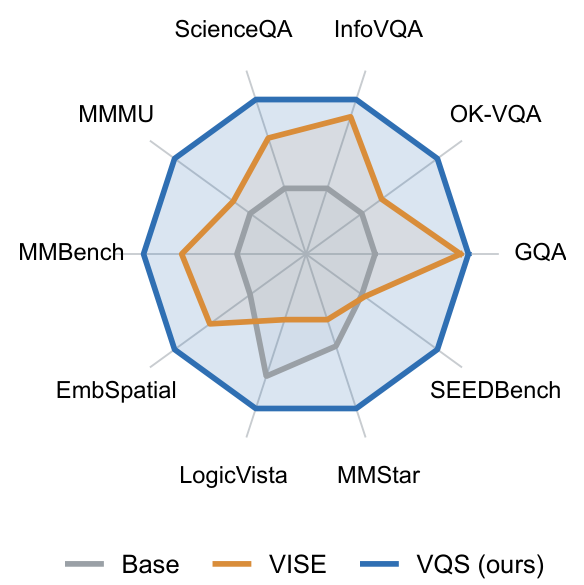
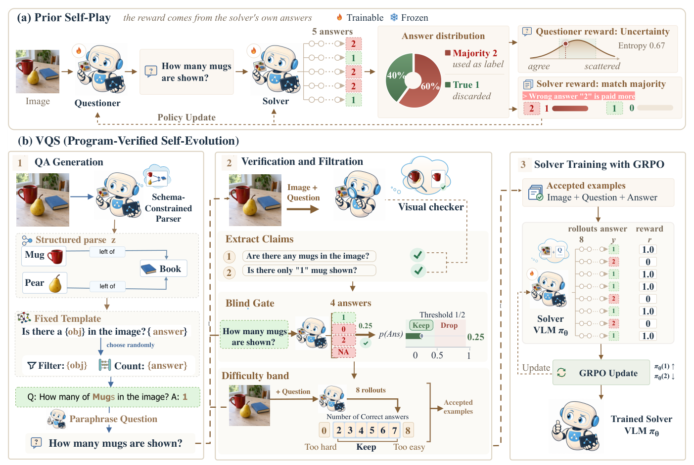
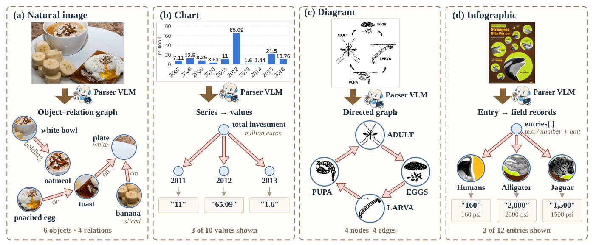
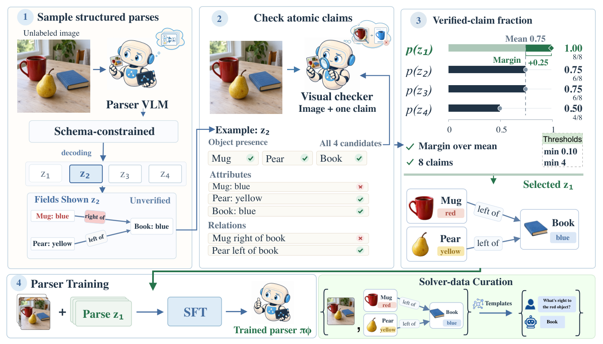
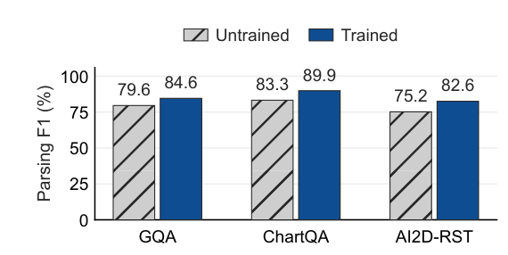
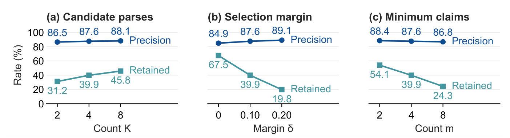
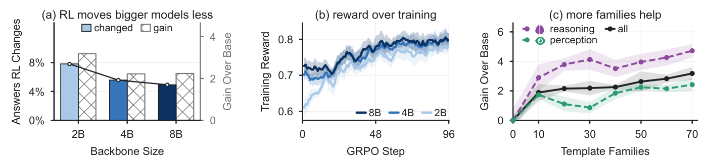
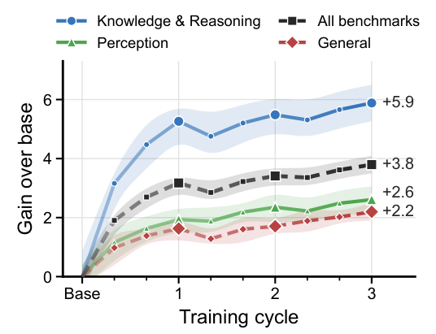

<div align="center">

# Program-Verified Self-Evolution for Vision-Language Models

**Ahmed Heakl**<sup>1,2</sup> &nbsp;·&nbsp; **Sungik Choi**<sup>1</sup> &nbsp;·&nbsp; **Moontae Lee**<sup>1,4</sup> &nbsp;·&nbsp; **Salman Khan**<sup>2,3</sup>

<sup>1</sup>LG AI Research &nbsp;&nbsp; <sup>2</sup>MBZUAI &nbsp;&nbsp; <sup>3</sup>Australian National University &nbsp;&nbsp; <sup>4</sup>University of Illinois at Chicago

<a href="https://arxiv.org/abs/2609.33855"></a>
<a href="https://huggingface.co/ahmedheakl/VQS"></a>
<a href="https://ahmedheakl.github.io/VQS/"></a>
<a href="https://github.com/ahmedheakl/VQS"></a>


</div>

<p align="center">
  
</p>

**VQS** (**V**erifiable **Q**A Generation for **S**elf-Evolving Models), from our paper
[*Program-Verified Self-Evolution for Vision-Language Models*](https://arxiv.org/abs/2609.33855), lets a
vision-language model improve itself from unlabeled images, without majority votes or model judges. The model parses each
image into a structured record (a scene graph, a chart table, a diagram graph), and fixed programs
write a question from that record and **compute** its answer. The same model then checks every fact
the program read, one short claim at a time, and those claim-level checks also pick the parser's own
training targets. One set of weights plays parser, checker and solver.

<table align="center">
  <tr>
    <td align="center" width="25%"><h3>94.4%</h3>of VQS answers are correct<br><sub>vs 76.4% for majority vote, 82.2% for a model judge</sub></td>
    <td align="center" width="25%"><h3>+3.18</h3>average over 10 benchmarks<br><sub>Qwen3-VL-2B, one training cycle</sub></td>
    <td align="center" width="25%"><h3>3 / 3</h3>model scales where VQS beats<br><sub>the strongest self-evolving baseline</sub></td>
    <td align="center" width="25%"><h3>+3.84</h3>after three training cycles<br><sub>Qwen3-VL-2B, still rising</sub></td>
  </tr>
</table>

<p align="center"><a href="https://ahmedheakl.github.io/VQS/#explore"><b>Explore 93 traced questions interactively →</b></a><br>
<sub>parses, template programs, fact-check read-backs and blind-gate guesses, from image to keep-or-drop</sub></p>

## Released model

[**VQS-2B**](https://huggingface.co/ahmedheakl/VQS) is Qwen3-VL-2B-Instruct trained with VQS. It loads like
any Qwen3-VL checkpoint:

```python
from transformers import AutoModelForImageTextToText, AutoProcessor
from PIL import Image

model = AutoModelForImageTextToText.from_pretrained("ahmedheakl/VQS", dtype="auto", device_map="auto")
processor = AutoProcessor.from_pretrained("ahmedheakl/VQS")

messages = [{"role": "user", "content": [
    {"type": "image"},
    {"type": "text", "text": "In 2020, which is higher, Stayovers or Day trippers?\n"
                             "Answer the question using a single word or phrase."},
]}]
text = processor.apply_chat_template(messages, add_generation_prompt=True, tokenize=False)
inputs = processor(text=[text], images=[Image.open("chart.png")], return_tensors="pt").to(model.device)
out = model.generate(**inputs, max_new_tokens=64, do_sample=False)
print(processor.batch_decode(out[:, inputs["input_ids"].shape[1]:], skip_special_tokens=True)[0])
```

See the [model card](https://huggingface.co/ahmedheakl/VQS) for vLLM usage and training details.

## Contents

- [Released model](#released-model)
- [Why computed answers](#why-computed-answers)
- [Method](#method)
- [Results](#results)
- [Getting started](#getting-started)
- [Hyperparameters](#hyperparameters)
- [Later training cycles](#later-training-cycles)
- [Repository layout](#repository-layout)
- [Citation](#citation)

## Why computed answers

Self-generated questions have no gold answers, so prior self-evolving methods label them with a
majority vote over sampled answers or with a model judge. In a human evaluation of 500 generated
questions, **24% of majority-vote labels and 18% of model-judge labels are wrong**, and a wrong
majority is exactly what the solver is then rewarded for. VQS instead computes the answer with a
program over a verified parse, so GRPO reinforces the correct answer even when most rollouts miss it.

<p align="center">
  
</p>
<p align="center"><sub><b>Majority-vote labels vs. computed answers.</b> (a) In prior self-play the
solver's majority answer becomes the label, so the wrong answer "2" is rewarded. (b) VQS parses the
image, a fixed template writes the question and computes the answer "1", a visual checker verifies
each claim behind it, a blind gate drops questions answerable without the image, a difficulty band
keeps questions the solver gets right in some but not all of 8 rollouts, and GRPO rewards exact match
with the computed answer.</sub></p>

## Method

**1. Structured parsing.** The parser turns each image into a record under a per-domain JSON schema
that the decoder enforces, so every parse is well formed.

<p align="center">
  
</p>

**2. Programs write the questions.** 70 template families (filter, read, count, extremum, follow a
relation, rank, compare, arithmetic, trend, arrow counts, coarse position) read the record and return
a question, its computed answer and its hop count. The parser then rewrites the question in natural
wording, and the rewrite is rejected if it adds any content word.

**3. Three filters.** A question is kept only if (i) every claim its answer rests on is confirmed by
the model looking at the image, one claim at a time; (ii) the model *without* the image gets it right
at most 2 of 4 times; and (iii) the solver about to be trained is right in some but not all of 8
rollouts.

**4. Label-free parser training.** Before any of this, the parser samples K = 4 parses of each
image. Each parse is scored by the fraction of its claims the checker confirms, and the best one
becomes an SFT target only if it beats the mean of the four by δ = 0.10 and asserts at least m = 4
claims.

<p align="center">
  
</p>

**5. GRPO.** The solver is trained with GRPO on the kept questions, in a curriculum that orders each
template family's questions by hop count. The reward is `0.9 · exact match + 0.1 · format`.

## Results

All numbers below are from the paper. Every model trains on unlabeled images only; no human
question, answer or label is used at any stage.

### Main results

VQS gives the largest average gain at every scale, and it improves all ten benchmarks at each.

**Qwen3-VL-2B-Instruct**

| Method | GQA | OK-VQA | InfoVQA | SQA | MMMU | MMB | ESB | LogicV | MMStar | SEED | **Avg** |
|:--|--:|--:|--:|--:|--:|--:|--:|--:|--:|--:|--:|
| Base | 58.25 | 40.76 | 69.02 | 79.42 | 38.92 | 74.48 | 68.54 | 35.04 | 55.62 | 72.16 | 59.22 |
| VisPlay | 58.65 | 41.15 | 69.96 | 80.74 | 39.27 | 74.52 | 68.56 | 34.93 | 55.37 | 71.62 | 59.48 (+0.26) |
| Vision-Zero | 58.98 | 41.39 | 70.93 | 81.96 | 39.58 | 75.07 | 69.72 | 35.28 | 55.58 | 71.53 | 60.00 (+0.78) |
| EvoLMM | 59.01 | 38.03 | 70.69 | 83.01 | 39.08 | 74.62 | 69.32 | 34.99 | 55.50 | 71.17 | 59.54 (+0.32) |
| iReasoner | 59.13 | 38.13 | 70.82 | 83.12 | 39.11 | 74.75 | 69.67 | 35.09 | 55.59 | 71.25 | 59.67 (+0.45) |
| VISE | 59.41 | 41.24 | 71.43 | 83.61 | 40.67 | 76.72 | 70.14 | 31.92 | 55.02 | 72.18 | 60.23 (+1.01) |
| **VQS (ours)** | **59.52** | **42.60** | **72.01** | **86.81** | **46.78** | **78.26** | **71.54** | **36.83** | **57.04** | **72.61** | **62.40 (+3.18)** |

<details>
<summary><b>Qwen3-VL-4B and 8B</b></summary>

**Qwen3-VL-4B-Instruct**

| Method | GQA | OK-VQA | InfoVQA | SQA | MMMU | MMB | ESB | LogicV | MMStar | SEED | **Avg** |
|:--|--:|--:|--:|--:|--:|--:|--:|--:|--:|--:|--:|
| Base | 60.32 | 47.86 | 77.73 | 87.51 | 45.17 | 83.42 | 76.79 | 49.78 | 62.67 | 75.71 | 66.70 |
| VisPlay | 60.06 | 48.04 | 77.96 | 87.30 | 45.42 | 83.47 | 76.11 | 49.34 | 62.13 | 74.83 | 66.47 (-0.23) |
| Vision-Zero | 61.30 | 48.41 | 78.28 | 88.46 | 46.27 | **84.83** | 77.02 | 49.11 | 62.45 | 75.01 | 67.19 (+0.49) |
| EvoLMM | 61.20 | 46.72 | 78.58 | 88.46 | 46.02 | 84.21 | 76.94 | 49.57 | 62.37 | 74.77 | 66.88 (+0.19) |
| iReasoner | 61.32 | 46.89 | 78.76 | 88.62 | 46.13 | 84.34 | 76.98 | 49.65 | 62.46 | 74.84 | 67.00 (+0.30) |
| VISE | 61.82 | **48.81** | **81.45** | 90.04 | 48.89 | 84.51 | 77.46 | 47.66 | 61.73 | 75.00 | 67.74 (+1.04) |
| **VQS (ours)** | **62.86** | 48.19 | 80.23 | **93.11** | **54.78** | 83.93 | **77.80** | **50.10** | **63.29** | **75.82** | **69.01 (+2.32)** |

**Qwen3-VL-8B-Instruct**

| Method | GQA | OK-VQA | InfoVQA | SQA | MMMU | MMB | ESB | LogicV | MMStar | SEED | **Avg** |
|:--|--:|--:|--:|--:|--:|--:|--:|--:|--:|--:|--:|
| Base | 61.54 | 49.84 | 81.23 | 90.88 | 50.12 | 84.71 | 77.66 | 52.23 | 64.96 | 74.96 | 68.81 |
| VisPlay | 61.66 | 49.93 | 81.36 | 91.02 | 52.61 | 84.62 | 78.24 | 51.88 | 64.52 | 74.34 | 69.02 (+0.21) |
| Vision-Zero | 62.12 | 50.31 | 82.44 | 92.35 | 52.89 | 85.11 | 77.96 | 52.33 | 64.75 | 74.33 | 69.46 (+0.65) |
| EvoLMM | 61.94 | 50.18 | 82.02 | 91.96 | 51.56 | 85.02 | 77.51 | 52.01 | 64.59 | 74.12 | 69.09 (+0.28) |
| iReasoner | 62.02 | 50.24 | 82.15 | 92.11 | 51.83 | 85.09 | 77.82 | 52.09 | 64.67 | 74.18 | 69.22 (+0.41) |
| VISE | **62.43** | 50.61 | 82.83 | 92.81 | 52.69 | 85.46 | **78.62** | 50.78 | 64.17 | 74.30 | 69.47 (+0.66) |
| **VQS (ours)** | 61.97 | **53.00** | **83.13** | **94.65** | **57.56** | **85.82** | 78.49 | **54.24** | **68.14** | **75.39** | **71.24 (+2.43)** |

</details>

<sub>InfoVQA = InfographicsVQA, SQA = ScienceQA, MMB = MMBench, ESB = EmbSpatial, LogicV = LogicVista.
Bold marks the best trained model per column.</sub>

### Are the generated answers correct?

Human raters checked 500 shared questions, 125 per visual domain.

| Answer source | Correct | Kept |
|:--|--:|--:|
| **Templates + checker (VQS)** | **94.4%** | 76.0% |
| Majority vote | 76.4% | 92.0% |
| Model judge | 82.2% | 90.8% |

### Does label-free training improve the parser?

Parser F1 against human annotations rises in every domain, and checking claims one at a time is the
best way to pick the parser's targets.

<p align="center">
  
</p>

| Parser target | Parse precision | Answer accuracy | Solver accuracy |
|:--|--:|--:|--:|
| Untrained | 80.8 | 86.8 | 58.0 |
| Random parse | 82.1 | 91.0 | 61.5 |
| Whole-parse check | 85.0 | 94.0 | 62.0 |
| **Per-claim check (VQS)** | **87.6** | **96.1** | **62.4** |

<p align="center">
  
</p>
<p align="center"><sub>Varying one setting around (K, δ, m) = (4, 0.10, 4).</sub></p>

### What matters

**Components** (Qwen3-VL-2B). Removing the fact-checker costs the most after parser training.

| Pipeline | Solver acc. | Parser prec. |
|:--|--:|--:|
| Untrained parser | 58.0 | 80.8 |
| **Full VQS** | **62.4** | **87.6** |
| without constrained decoding | 61.9 | 85.3 |
| without fact-checker | 60.9 | 87.6 |
| without blind gate | 61.8 | 87.6 |
| without difficulty band | 62.1 | 87.6 |

**Question design** (Qwen3-VL-2B, equal training budget). Bold marks the VQS default.

| Choice | Setting → solver accuracy |
|:--|:--|
| Family difficulty | Easy 60.8 · **Middle 62.4** · Hard 61.1 |
| Generator | **Fixed templates 62.4** · model-written programs 61.4 |
| Curriculum | Shuffled 61.3 · global hops 61.7 · **within-family hops 62.4** |
| Difficulty band | **Initial selection 62.4** · refreshed selection 62.3 |

### Scale, coverage and more cycles

<p align="center">
  
</p>
<p align="center"><sub>(a) Share of benchmark answers RL changes. (b) Smoothed training reward.
(c) 2B gain over base against the number of template families.</sub></p>

<table>
<tr>
<td width="45%"></td>
<td valign="middle">

**Gains keep growing over cycles.** Each new cycle merges the previous solver, writes new questions
from the templates on the same images and resamples them toward a 50% solve rate. The average gain at
2B grows from **+3.18** after one cycle to **+3.41** and **+3.84** after two and three, led by
knowledge and reasoning benchmarks (+5.94), with ScienceQA at +8.53 and MMMU at +8.44.

</td>
</tr>
</table>

<details>
<summary><b>Other model families</b> (Gemma 3, InternVL3, Llama 3.2)</summary>

**Gemma3-12B-It**

| Method | GQA | OK-VQA | InfoVQA | SQA | MMMU | MMB | ESB | LogicV | MMStar | SEED | **Avg** |
|:--|--:|--:|--:|--:|--:|--:|--:|--:|--:|--:|--:|
| Base | 61.20 | 62.40 | 52.10 | 94.30 | 46.50 | 76.40 | 24.50 | 41.80 | 58.90 | 74.20 | 59.23 |
| **VQS (ours)** | **62.02** | **62.71** | **55.29** | **95.23** | **50.84** | **79.06** | **27.70** | **42.87** | **59.80** | **74.47** | **61.00 (+1.77)** |

**InternVL3-8B-Instruct**

| Method | GQA | OK-VQA | InfoVQA | SQA | MMMU | MMB | ESB | LogicV | MMStar | SEED | **Avg** |
|:--|--:|--:|--:|--:|--:|--:|--:|--:|--:|--:|--:|
| Base | 65.40 | 64.10 | 68.80 | 96.50 | 51.20 | 81.30 | 28.10 | 48.60 | 63.70 | 76.90 | 64.46 |
| **VQS (ours)** | **66.01** | **64.36** | **71.81** | **96.71** | **54.87** | **83.17** | **31.99** | **49.42** | **64.32** | **77.08** | **65.97 (+1.51)** |

**Llama-3.2-11B-Vision-Instruct**

| Method | GQA | OK-VQA | InfoVQA | SQA | MMMU | MMB | ESB | LogicV | MMStar | SEED | **Avg** |
|:--|--:|--:|--:|--:|--:|--:|--:|--:|--:|--:|--:|
| Base | 56.00 | 55.40 | 46.90 | 91.80 | 50.70 | 72.80 | 21.20 | 36.50 | 55.10 | 71.30 | 55.77 |
| **VQS (ours)** | **57.13** | **56.05** | **49.87** | **93.47** | **53.64** | **76.04** | **24.18** | **37.79** | **56.22** | **71.68** | **57.61 (+1.84)** |

</details>

## Getting started

### Install

```bash
git clone https://github.com/ahmedheakl/VQS && cd VQS
pip install -r requirements.txt
git clone https://github.com/hiyouga/EasyR1 && (cd EasyR1 && pip install -e .)                 # GRPO
git clone https://github.com/hiyouga/LLaMA-Factory && (cd LLaMA-Factory && pip install -e .)   # parser SFT
git clone https://github.com/EvolvingLMMs-Lab/lmms-eval && (cd lmms-eval && pip install -e .)  # evaluation
export VQS=$PWD EASYR1=$PWD/EasyR1
```

`data/manifest.jsonl` lists the unlabeled images, one JSON object per line:
`{"image": "...", "domain": "...", "id": "..."}` with `domain` in `charts | infographics | natural | diagrams`.

### One training cycle

```bash
# sanity checks, CPU only
python vqs/gen_questions.py --selftest
python vqs/reward/exact_match.py

# 0. train the parser: best-of-K targets, then SFT     → runs/parser_sft
python vqs/select_parser_targets.py --manifest data/manifest.jsonl --out data/parser_sft
llamafactory-cli train configs/parser_sft.yaml
# a full fine-tune in LLaMA-Factory does not save chat_template.json; copy the base model's
python -c "from huggingface_hub import hf_hub_download as d; import shutil; shutil.copy(d('Qwen/Qwen3-VL-2B-Instruct', 'chat_template.json'), 'runs/parser_sft/')"
P=runs/parser_sft

# 1. parse with the trained parser                    → parses.jsonl
python vqs/parse_images.py --manifest data/manifest.jsonl --out data/parses.jsonl --model $P

# 2. generate and paraphrase                          → raw.jsonl, para.jsonl
python vqs/gen_questions.py --parses data/parses.jsonl --out data/raw.jsonl
python vqs/paraphrase.py --qa data/raw.jsonl --out data/para.jsonl --model $P

# 3. fact-check, blind gate, package, difficulty band → rl_band/{train,val}.jsonl
python vqs/filter_by_facts.py --qa data/para.jsonl --out data/verified.jsonl --model $P
python vqs/blind_gate.py --qa data/verified.jsonl --out data/gated.jsonl --model $P
python vqs/build_rl_data.py --qa data/gated.jsonl --out data/rl_pool
python vqs/difficulty.py band --data data/rl_pool --out data/rl_band

# 4. train, merge the adapter, evaluate
GPUS=0,1 bash scripts/train.sh data/rl_band vqs_2b
python $EASYR1/scripts/model_merger.py --local_dir runs/vqs_2b/ckpt/global_step_96/actor
bash scripts/eval.sh 0 runs/vqs_2b/ckpt/global_step_96/actor/huggingface
```

The commands are for Qwen3-VL-2B. For 4B or 8B, pass that base checkpoint to every `--model` (and to
`model_name_or_path` in `configs/parser_sft.yaml`) and set `MODEL` for `scripts/train.sh`; the parser
and the solver always start from the same pretrained weights.

> [!NOTE]
> GRPO training needs at least 2 GPUs. With one rank, FSDP falls back to `NO_SHARD`, whose
> `_use_sharded_views()` asserts that every parameter view is an `nn.Parameter`; under PEFT the
> frozen base weights are plain tensors and the run dies. The paper's runs used 8 AMD MI210 GPUs.

## Hyperparameters

Every setting the paper reports, and where it is set.

**Data (paper Sec. 3–4)**

| Stage | Setting | Where |
|:--|:--|:--|
| Parser targets | K = 4 parses per image, temperature 1.0, top-p 0.95, ≤ 2048 tokens, schema-constrained | `vqs/select_parser_targets.py` |
| | keep the best parse z\* only if P(z\*) − mean P ≥ δ = 0.10 and z\* asserts ≥ m = 4 claims | `vqs/select_parser_targets.py` |
| Parser SFT | full fine-tune, vision tower frozen, per-device batch 4 × 8 accumulation steps, lr 1e-5, 2 epochs | `configs/parser_sft.yaml` |
| Parsing | greedy, ≤ 2048 tokens, schema-constrained | `vqs/parse_images.py` |
| Paraphrase | the parser, greedy; the template wording is kept if the rewrite adds a content word | `vqs/paraphrase.py` |
| Fact-check | the parser answers YES/NO to one claim at a time, greedy, 4 new tokens; every claim must hold | `vqs/filter_by_facts.py` |
| Blind gate | the parser without the image answers J = 4 times; drop if more than λ = 0.5 match | `vqs/blind_gate.py` |
| Difficulty band | the base solver at training settings: 8 rollouts, temperature 1.0, 256 tokens; keep 0 < p̂ < 1 | `vqs/difficulty.py band` |
| Curriculum | each template family's questions ordered by hop count, fewest first | `vqs/build_rl_data.py` |
| Answer format | single word or phrase / single number / option's letter, by answer type | `vqs/build_rl_data.py` |

**Solver GRPO (paper Sec. A.1, Table 7)**, all in `scripts/train.sh`

| | |
|:--|:--|
| Backbone | `Qwen/Qwen3-VL-{2B,4B,8B}-Instruct` (`MODEL`, default 2B) |
| Adapter | LoRA r = 64, α = 128, all linear layers, `.*visual.*` excluded (0 trainable visual parameters) |
| Gradient checkpointing | on |
| Optimizer | AdamW, betas (0.9, 0.999), weight decay 0.01, lr 1e-5 constant |
| KL penalty | low-variance estimator, β = 0.01, frozen reference |
| Clipping | ratio 0.2 (low) / 0.3 (high), dual clip 3.0 |
| PPO epochs per step | 1 |
| Dynamic sampling | off |
| Rollouts | 8 per prompt, temperature 1.0, top-p 1.0 |
| Budgets | prompt 2048 tokens, response 256 tokens, images ≤ 1,003,520 pixels |
| Batches | rollout 256 prompts, global update 128; micro-batch per device 16 at 2B, 4 at 8B |
| vLLM memory | 0.60 |
| Steps | 96 |
| Reward | 0.9 · exact match with the computed answer + 0.1 · format (`vqs/reward/exact_match.py`) |

**Evaluation (paper Sec. 4)**: lmms-eval on the 10 benchmarks, each with its default generation
settings (`scripts/eval.sh`).

## Later training cycles

Each new cycle (paper Sec. 5) starts from the previous solver with its LoRA merged, writes new
questions from the templates on the same images, and adds them to the earlier cycles' questions. The
merged solver answers every question 8 times; with s its fraction correct, each question is weighted
by w(s) = exp(−((s − 0.5) / 0.15)²), with w = 0 at s = 0 and s = 1, and 8,000 training rows are drawn
with these weights. The solver then trains 96 GRPO steps from the previous cycle with the same
settings.

```bash
PREV=runs/vqs_2b/ckpt/global_step_96/actor        # merged above: $PREV/huggingface
python vqs/gen_questions.py --parses data/parses.jsonl --out data/c2/raw.jsonl --seed 2
python vqs/paraphrase.py --qa data/c2/raw.jsonl --out data/c2/para.jsonl --model $P
python vqs/filter_by_facts.py --qa data/c2/para.jsonl --out data/c2/verified.jsonl --model $P
python vqs/blind_gate.py --qa data/c2/verified.jsonl --out data/c2/gated.jsonl --model $P
python vqs/build_rl_data.py --qa data/c2/gated.jsonl --out data/c2/rl_pool
python vqs/difficulty.py resample --data data/rl_band data/c2/rl_pool --out data/c2/rl_train \
    --model $PREV/huggingface
GPUS=0,1 MODEL=$PREV/huggingface bash scripts/train.sh data/c2/rl_train vqs_2b_c2
```

A third cycle adds `data/c3/rl_pool` to `--data` and starts from the second cycle's merged solver.

## Repository layout

```
vqs/select_parser_targets.py  best-of-K parser targets (Eq. 5-6)
configs/parser_sft.yaml       parser SFT with LLaMA-Factory
vqs/parse_images.py           per-domain JSON schemas and prompts
vqs/gen_questions.py          converters and calls into the template families
vqs/src/                      the template family programs
vqs/paraphrase.py             guarded rewrite of the template question
vqs/filter_by_facts.py        per-claim fact-check
vqs/blind_gate.py             drops questions answerable without the image
vqs/build_rl_data.py          answer-format suffixes, curriculum order, train/val split
vqs/difficulty.py             difficulty band; resampling for later cycles
vqs/vlm.py                    shared vLLM prompt wrappers and chunked generation
vqs/reward/exact_match.py     the GRPO reward (Eq. 2)
scripts/train.sh              GRPO with the settings of Table 7
scripts/eval.sh               lmms-eval over the 10 benchmarks
```

## Citation

```bibtex
@article{heakl2026vqs,
  title   = {Program-Verified Self-Evolution for Vision-Language Models},
  author  = {Heakl, Ahmed and Choi, Sungik and Lee, Moontae and Khan, Salman},
  journal = {arXiv preprint arXiv:2609.33855},
  year    = {2026},
  url     = {https://arxiv.org/abs/2609.33855}
}
```

## Acknowledgements

Training uses [EasyR1](https://github.com/hiyouga/EasyR1), parser SFT uses
[LLaMA-Factory](https://github.com/hiyouga/LLaMA-Factory), and evaluation uses
[lmms-eval](https://github.com/EvolvingLMMs-Lab/lmms-eval).
